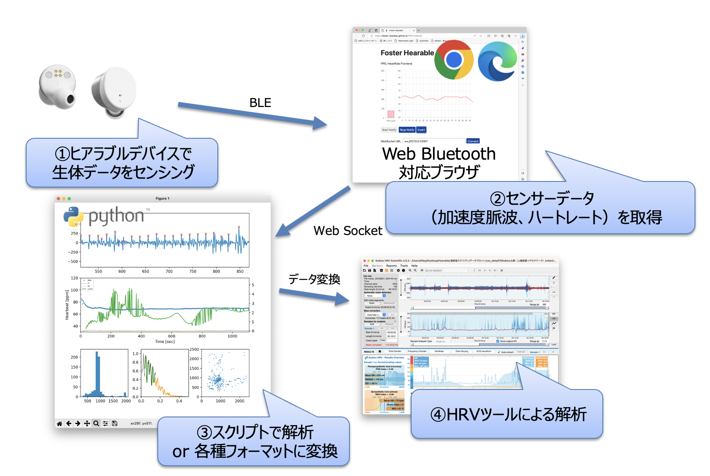

# Hearable PPGFrontend
---
## Overview
Hearable PPGFrontendはヒアラブルデバイス（フォスター電機 RN002）に実装されているハートレート機能のフロントエンドアプリケーションです。\
★ デモ用Webサイト [https://foster-hearable.github.io/PPGFrontend/](https://foster-hearable.github.io/PPGFrontend/)

WebBluetoothを用いてヒアラブルデバイスRN002からデータ取得を行い、ハートレート情報の表示やWebSocketサーバーへのデータ送出を行います。\
WebSocketのデータは加速度脈波のRAWデータで構成されているため、WebSocketサーバー側での加工や解析に用いることができます。

## 対応ブラウザ
WebBluetoothに対応したブラウザ　参考：[ブラウザー互換性一覧表 Mozilla.org](https://developer.mozilla.org/ja/docs/Web/API/Web_Bluetooth_API#ブラウザーの互換性)

#### 動作することを確認しているブラウザ
- Chrome（Windows,Mac）
- Edge（Windows,Mac）
  
#### 動作しないことを確認しているブラウザ
- Safari（Mac,iOS）

## 操作インターフェース

#### ① PPG Level
ヒアラブルデバイスより送られてくる脈波をメーターで表示します。

#### ② Heart Rate
ヒアラブルデバイスより送られてくるハートレートのデータ履歴を表示します。（最大100秒）

#### ③ Controls
- Start Notify：クリックするとBLEデバイスの選択ウィンドウが表示されます（選択後、通知データが送られてくるまで20秒程度かかる場合があります）
- Stop Notify：ヒアラブルデバイスからのデータ通知を停止する場合にクリックします。データ通知を再開させたい場合にはブラウザをリロードしてください。
- Invert：①PPG Levelで表示する位相を反転します。メーター動作が不安定な場合にクリックしてください（データ通知停止後にはブラウザのリロードボタンに切り替わります）

#### ④ WebSocket
- WebSocket URL：WebSocketで接続するURLを指定してください。
- Connect：WebSocket URLとの接続/切断を行います。本ページがロードされた直後に自動的に接続を試みます。
  
#### ⑤ Status
- 接続しているデバイス名や受信したデータの種別やデータ数を表示します

## WebSocketでの拡張
WebSocketで送られてきたヒアラブルデバイスの脈波データを各種解析ツールのインプットとして用いることにより、ヒアラブルデバイスで取得した生体データを多面的な解析に利用することが可能となります。

#### WebSocketデータフォーマット
コンマ区切りで加速度脈波（RAWデータ Int値：-32768〜32767、サンプルレート：100Hz）のデータ列を送出します。

## 注意事項
- ヒアラブルデバイスに接続してから生体データが更新されるまで最大で20秒程度の時間がかかる場合があります。
- 左右のヒアラブルデバイスを使用している場合、状況に応じて自動的にどちらか片側のヒアラブルデバイスからのセンサー情報を取得します。\
  右または左の任意のヒアラブルデバイスからデータ取得を行いたい場合は、使用しないヒアラブルデバイスをチャージケースに収納してから接続してください。
- 動作確認されているブラウザであっても、バージョンやプラグインの状況などによってはアプリケーションが正常に動作しないことがあります。また、ブラウザまたはシステムの省エネモードなどの影響によりデータ更新タイミングが変化する場合があります。

  
※ワイヤレス通信は周囲の状況によりデータ欠落や再送・遅延が発生します。センサーデータはこれらの事象を考慮したうえでご利用ください。\
※このアプリケーションおよびヒアラブルデバイス（フォスター電機 RN002）は医療機器ではありません。医療行為には使用できません。\
※このアプリケーションはヒアラブルデバイス（フォスター電機 RN002）の評価を目的として[MITライセンス](https://github.com/foster-hearable/HeadTracker/blob/e59c1e2fe2de506fb53649f6b3cb550f1e6ca852/LICENSE.txt)の下に公開しております。
